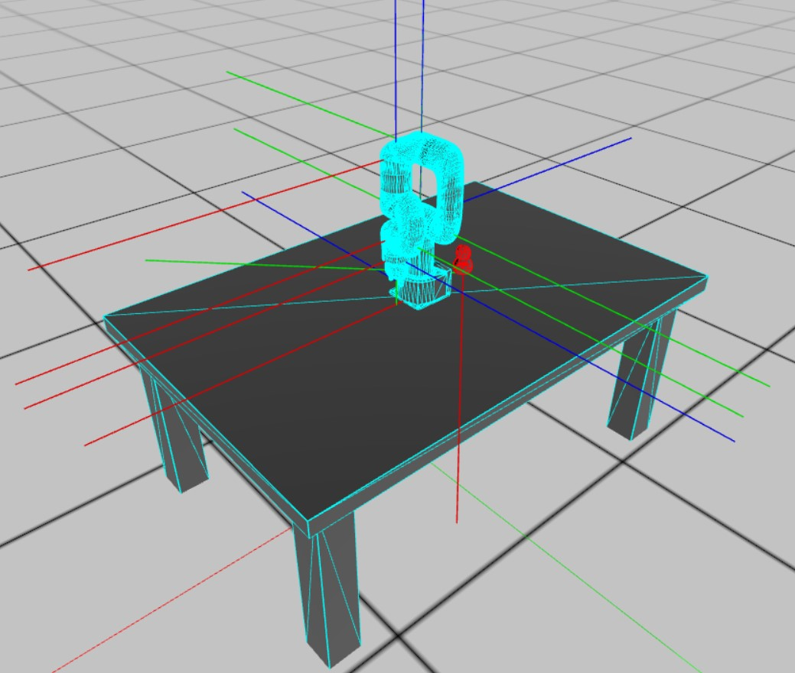

# enable3d-ammojs-vite-example
Enable3d Ammojs Vite lite 6 robot



## Install & Run

```console
# download this repo
git clone https://github.com/Mordween/enable3D.git

# navigate into the directory
cd enable3D

# install
npm install

# build
npm run build

# start
npm run dev

```


